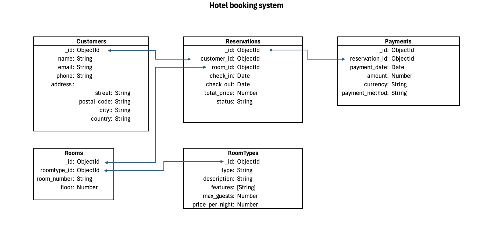
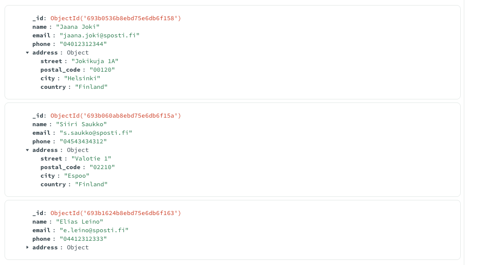

# NoSQL MongoDB Course Project

This project is my first NoSQL course assignment, implemented using MongoDB and Python. The goal of the project was to design a logical data model and implement basic CRUD (Create, Read, Update, Delete) operations using MongoDB principles.

## Project Description

The system represents a simple hotel booking application with the following collections:

- Customers
- Reservations
- Rooms
- RoomTypes
- Payments

The main focus on this project is database design and relationships between collections, understanding NoSQL concepts and basic database operations.

## Data Model

The data model is shown below:

Here is a screenshot of the `customers` collection in MongoDB Compass, showing embedded addresses:

## Implementation Details

- MongoDB is used as the NoSQL database
- Python and PyMongo are used to interact with MongoDB
- The application is a command-line interface
- CRUD operations are fully implemented for **Customers** and **Reservations** collections, as required by the course assignment.
- References (ObjectId) are used to link related collections
- Customers use **embedded documents** for addresses
- For simplicity, each customer is allowed only one active reservation at a time.

## Technologies Used

- Python
- MongoDB
- PyMongo
- VS Code
